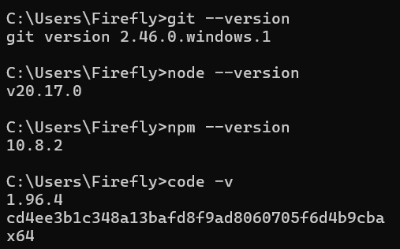
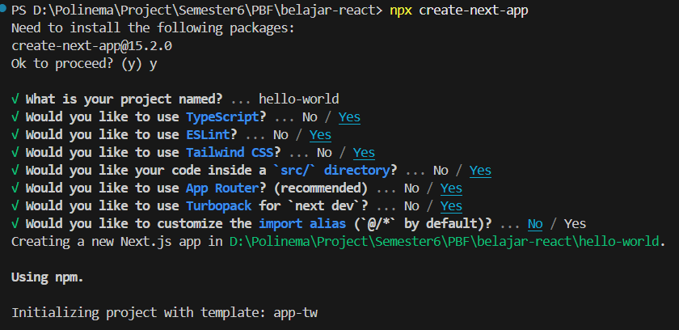
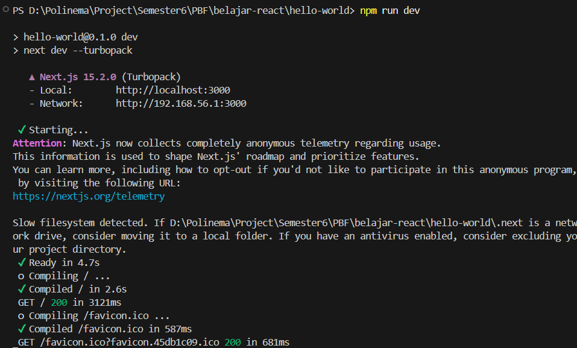
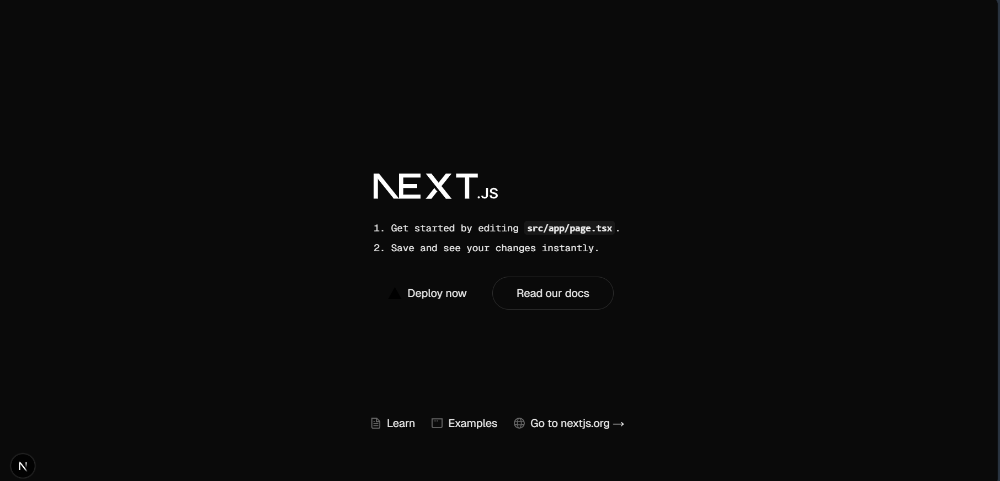
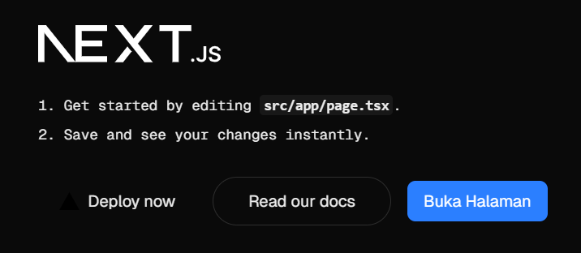
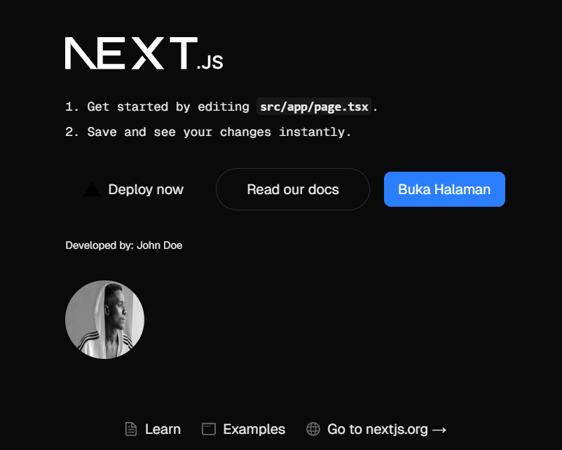

This is a [Next.js](https://nextjs.org) project bootstrapped with [`create-next-app`](https://nextjs.org/docs/app/api-reference/cli/create-next-app).

## Getting Started

First, run the development server:

```bash
npm run dev
# or
yarn dev
# or
pnpm dev
# or
bun dev
```

Open [http://localhost:3000](http://localhost:3000) with your browser to see the result.

## Laporan Praktikum Pertemuan 1

|  | Pemrograman Berbasis Framework 2025 |
|--|--|
| NIM |  2241720258|
| Nama |  Haidar Aly |
| Kelas | TI - 3B |

### Jawaban Praktikum 1

1. Jelaskan kegunaan masing-masing dari Git, VS Code dan NodeJS yang telah Anda install pada sesi praktikum ini!
    - Git adalah sistem kontrol versi yang digunakan untuk mengelola perubahan pada kode program. 
    - Visual Studio Code (VS Code) adalah sebuah editor kode sumber yang dikembangkan oleh Microsoft. Kegunaan dari VS Code adalah menulis, mengedit, dan mendebug kode program.
    - Node.js adalah sebuah runtime environment yang digunakan untuk menjalankan kode JavaScript di luar browser. Kegunaan dari Node.js adalah membangun aplikasi server-side, membuat aplikasi real-time, dan mengembangkan aplikasi mikroservis.

2. Buktikan dengan screenshoot yang menunjukkan bahwa masing-masing tools tersebut telah berhasil terinstall di perangkat Anda!
    - Screenshot bukti instalasi
    
    
### Jawaban Praktikum 2

1. Jelaskan istilah TypeScript, ESLint, Tailwind CSS, App 
Router, Import alias, App router, dan Turbopack! 
- TypeScript: Bahasa pemrograman yang digunakan untuk membuat kode yang lebih aman dan mudah dipahami dengan menambahkan fitur tipe data statis pada JavaScript.
- ESLint: Alat yang digunakan untuk memeriksa kode JavaScript dan menemukan kesalahan atau peringatan tentang kode yang tidak sesuai dengan standar tertentu.
- Tailwind CSS: Kerangka kerja CSS yang digunakan untuk membuat desain antarmuka pengguna yang responsif dan konsisten dengan menggunakan utility-first approach.
- App Router: Sistem routing yang digunakan pada Next.js untuk mengatur navigasi antar halaman pada aplikasi web.
- Import alias: Fitur yang memungkinkan penggunaan nama alias untuk mengimport modul atau file pada proyek, sehingga membuat kode lebih singkat dan mudah dibaca.
- App Router: Sistem routing yang digunakan pada Next.js untuk mengatur navigasi antar halaman pada aplikasi web.
- Turbopack: Alat pembangunan yang digunakan pada Next.js untuk meningkatkan kecepatan dan efisiensi dalam membangun aplikasi web.

2. Apa saja kegunaan folder dan file yang ada pada struktur proyek React yang tampil pada gambar pada tahap percobaan ke-3!
- `app`: Folder yang berisi kode aplikasi, termasuk halaman, layout, dan komponen.
- `components`: Folder yang berisi komponen-komponen yang dapat digunakan kembali pada aplikasi.
- `public`: Folder yang berisi file statis yang dapat diakses secara langsung oleh browser.
- `styles`: Folder yang berisi file CSS yang digunakan untuk mengatur tampilan aplikasi.
- `pages`: Folder yang berisi file-file yang mewakili halaman-halaman pada aplikasi.
- `api`: Folder yang berisi file-file API yang digunakan untuk mengakses data dari server.
- `next.config.js`: File yang berisi konfigurasi untuk Next.js.
- `package.json`: File yang berisi informasi tentang proyek, termasuk dependensi dan script.
- `README.md`: File yang berisi informasi tentang proyek, termasuk cara menjalankan dan menggunakan aplikasi.

3. Screenshot bukti pengerjaan
    - Screenshot proses pembuatan new project
    

    - Screenshot proses npm run new project
    

    - Screenshot new project yang berhasil dirun
    

### Jawaban Praktikum 3
1. Screenshot bukti pengerjaan
    - Screenshot proses membuat komponen mybutton
    

### Jawaban Praktikum 4
1. Jelaskan apa kegunaan sintaks user.imageUrl
- `user.imageUrl` digunakan untuk mengakses URL gambar profil pengguna.

2. Screenshot bukti pengerjaan
    - Screenshot proses membuat komponen profile
    
